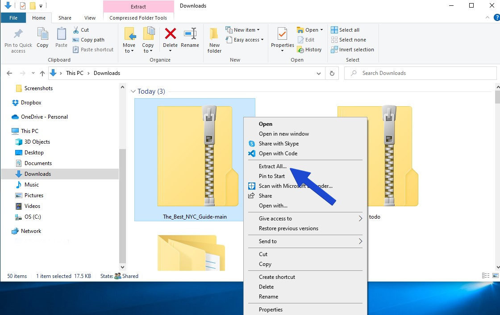
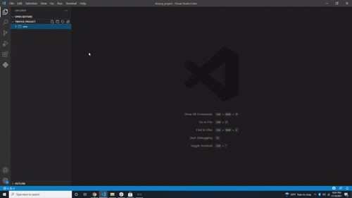
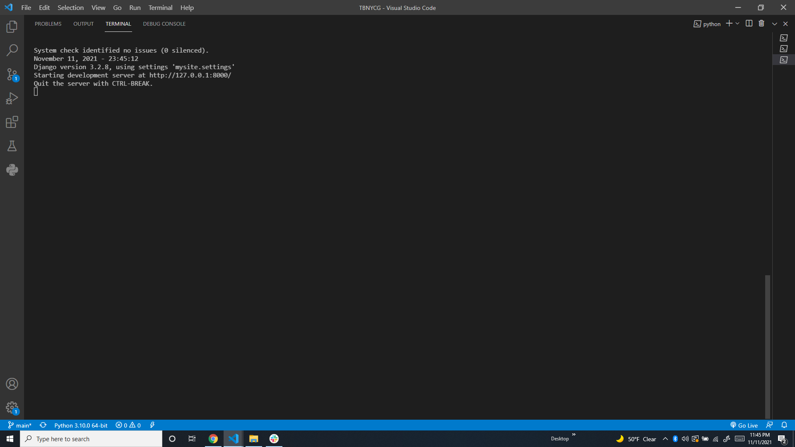

Authors: Cassandra Owens / [Cceanowens](https://github.com/Cceanowens) & Manuel Ramos / [Manny2trill](https://github.com/Manny2trill) 
 
#  <h1>About the project</h1>
This project is a guide to NYC. It is a website that will help you find beaches, airports, parks, zoos and food in the city. Created using Python and Django.

 
 

# Seting up the Environment

- On your Windows create a folder called `tbnycg_project` . You'll use this folder to store the app you will use.
- `cd` into the `tbnycg_project` folder and run the following command in the terminal
- Run `python3 -m venv django-env` to create a new virtual environment
- Run `django-env\Scripts\activate.bat` on Windows to activate the virtual environment
- Run `pip install django` to install Django
- Run `pip freeze > requirements.txt`
 
 

# Starting The Best New York City Guide

* Download the zip file to get started. [Download Here](https://github.com/cceanowens/The_Best_NYC_Guide/archive/refs/heads/main.zip)
 

* Go to the downloads folder right click on the file and  unzip the file
 

 

 

* Once the file is unzipped, you'll see a folder called 'The Best NYC Guide', drag the folder into the enviroment you created and press copy.
 

 
 

* Next `cd` into the folder and run the following command in the terminal
  
* Run `python3 manage.py runserver` to start the server
 

* You should see the server running
 

 
 

* Go to your browser and go to http://localhost:8000/
 

 

# Now you can start using The Best New York City Guide
* When you go to the homepage, you'll see a list of all the boroughs in the city. You can click on any borough to see the list of parks, restaurants, and other attractions in that borough.

* Dont forget to use The Best New York City Guide as your reference when you're looking for a place to go in NYC!
 
